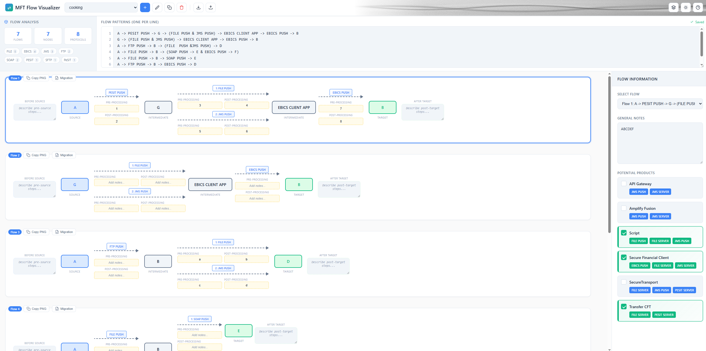
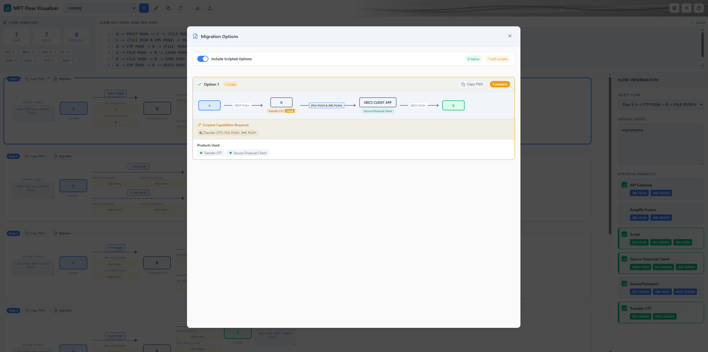

# MFT Flow Visualizer

A powerful web-based tool for designing, visualizing, and documenting Managed File Transfer (MFT) flow patterns. Perfect for architects and engineers planning file transfer migrations to Axway products.



## Features

### Core Visualization
- **Visual Flow Design** - Create flow diagrams using a simple text-based syntax with real-time rendering
- **Multi-Flow Support** - Define multiple flows per workspace (one per line)
- **Line Numbers** - Editor with synchronized line numbers for easy reference
- **Flow Analysis Panel** - Live statistics showing flow count, node count, and protocol usage
- **Protocol Tags** - Clickable protocol tags that highlight occurrences in the editor

### Advanced Flow Patterns
- **Parallel Inputs** - Multiple protocols converging to a single target: `(JMS PUSH & FILE PUSH)`
- **Parallel Outputs (Branching)** - One source branching to multiple targets: `(SFTP PUSH -> Target1 & HTTPS PUSH -> Target2)`
- **Continuation Chains** - Extended flows after parallel outputs with full chain support

### Documentation & Annotations
- **Pre/Post-Processing Notes** - Add annotations to each connection describing transformations
- **Before Source / After Target** - Document what happens before and after the flow
- **General Notes** - Add detailed notes for each flow
- **Per-Branch Annotations** - Unique annotation fields for each parallel branch

### Product Intelligence
- **Smart Product Detection** - Automatically identifies Axway products based on protocols used
- **Product Selection** - Select which products to use for migration planning
- **Native vs Scripted Capabilities** - Distinguishes between native product features and script-extended capabilities
- **Migration Options Generator** - Shows all valid product combinations with scripting requirements

### Workspace Management
- **Multiple Workspaces** - Organize flows into separate workspaces
- **Rename/Duplicate/Delete** - Full workspace management
- **Export/Import** - Share workspaces with colleagues via JSON export
- **Auto-Save** - Changes are automatically persisted to local storage

### Export & Sharing
- **PNG Export** - Copy individual flows as PNG images to clipboard
- **Migration Option PNG** - Export migration diagrams as images
- **Kroki D2 Diagrams** - Generate architecture diagrams via Kroki API with zoom/pan controls
- **Workspace JSON** - Full workspace export/import

### User Experience
- **Dark/Light Theme** - Toggle between themes for comfortable viewing
- **Keyboard Shortcuts** - Ctrl+Shift+T for theme, Ctrl+N for new workspace
- **Invalid Protocol Detection** - Highlights unknown protocols with dropdown to select valid ones
- **Responsive Layout** - Adapts to different screen sizes

## Getting Started

Simply open `index.html` in a modern web browser. No installation or server required!

## How to Use

### 1. Define Flow Patterns

Write your flow patterns in the text area using this simple syntax:

```
Source -> PROTOCOL DIRECTION -> Intermediate -> PROTOCOL DIRECTION -> Target
```

**Basic Examples:**
```
Banque <- EBICS PULL <- Gateway -> PeSIT PUSH -> Linux Lyon
Partner <- SFTP PUSH <- SecureTransport -> HTTPS PULL -> Cloud Storage
```

**Direction Keywords:**
- `PULL` - The node pulls/receives data
- `PUSH` - The node pushes/sends data

**Arrow Direction:**
- `<-` indicates flow direction to the left
- `->` indicates flow direction to the right

### 2. Parallel Inputs (Multiple Protocols to Same Target)

Use parentheses with `&` to define multiple protocols converging:

```
Source -> (JMS PUSH & FILE PUSH) -> SFC
```

### 3. Parallel Outputs (Branching to Multiple Targets)

Branch from one node to multiple targets:

```
SFC -> (EBICS PUSH -> Banque & FILE PUSH -> CFT -> PESIT PUSH -> Partner)
```

Each branch can continue with additional nodes and connections.

### 4. View the Visualization

As you type, the flow diagram updates in real-time showing:
- **Source** (blue) - Origin of the data
- **Intermediate** (yellow) - Nodes that process/relay the data
- **Target** (green) - Final destination

### 5. Add Documentation

Select a flow to add:
- **General Notes** - Overall flow description
- **Before Source** - Pre-flow activities
- **After Target** - Post-flow activities
- **Pre/Post-Processing** - Annotations on each connection

### 6. Select Products & Generate Migration Options

1. Select a flow to see potential Axway products
2. Check the products you want to use for migration
3. Click "Migration" to see all valid product combinations
4. Toggle "Include Scripted Options" to see script-extended capabilities
5. Copy migration diagrams as PNG



### 7. Generate Architecture Diagrams

Click the Kroki button to generate a D2 architecture diagram showing all nodes and connections across your flows. Features include:
- Zoom in/out controls
- Pan by dragging
- Copy D2 code
- Open in external Kroki viewer

### 8. Export Your Work

- **Export Workspace** - Save as JSON to share with colleagues
- **Import Workspace** - Load a previously exported workspace
- **Copy PNG** - Copy individual flows or migration options as images

## Supported Products & Protocols

### Axway Products
- **SecureTransport** - PeSIT, SFTP, HTTP/S, FTP/S, AS2, Cloud Storage connectors
- **Transfer CFT** - PeSIT, SFTP
- **Secure Financial Client** - EBICS, SWIFTNet FileAct/InterAct
- **Electronic Signature** - EBICS TS
- **API Gateway** - HTTP/S, JMS, AMQP, SOAP, IBM MQ
- **Amplify Fusion** - HTTP/S, JMS, AMQP, Kafka, JDBC

### Protocols
- **File Transfer**: PeSIT, SFTP, FTPS, FTP, SCP, SSH
- **Web**: HTTP, HTTPS, HSTS
- **B2B**: AS2, EBICS, SWIFTNet
- **Messaging**: JMS, IBM MQ, Kafka, AMQP
- **Cloud**: Amazon S3, Azure Blob/File Storage, Google Cloud Storage, SharePoint, OneDrive, Google Drive
- **Other**: FILE, SMTP, CMD, API

## Tips

- Use one flow per line for multiple flows
- Entity names can include spaces and special characters
- Click on protocol tags in the analysis panel to highlight them in the editor
- Unknown protocols show a dropdown - click to select a valid one
- Use "FILE PUSH" or "FILE PULL" for generic file operations
- Parallel outputs support complex branching with continuation chains

## Keyboard Shortcuts

| Shortcut | Action |
|----------|--------|
| `Ctrl+Shift+T` | Toggle dark/light theme |
| `Ctrl+N` | Create new workspace |
| `Escape` | Close modals |

## Technology

Built with vanilla HTML, CSS, and JavaScript. External dependencies:
- [html2canvas](https://html2canvas.hertzen.com/) - PNG export
- [pako](https://github.com/nodeca/pako) - Compression for Kroki API
- [Kroki](https://kroki.io/) - D2 diagram generation

## License

Internal Axway tool for MFT migration planning and documentation.
