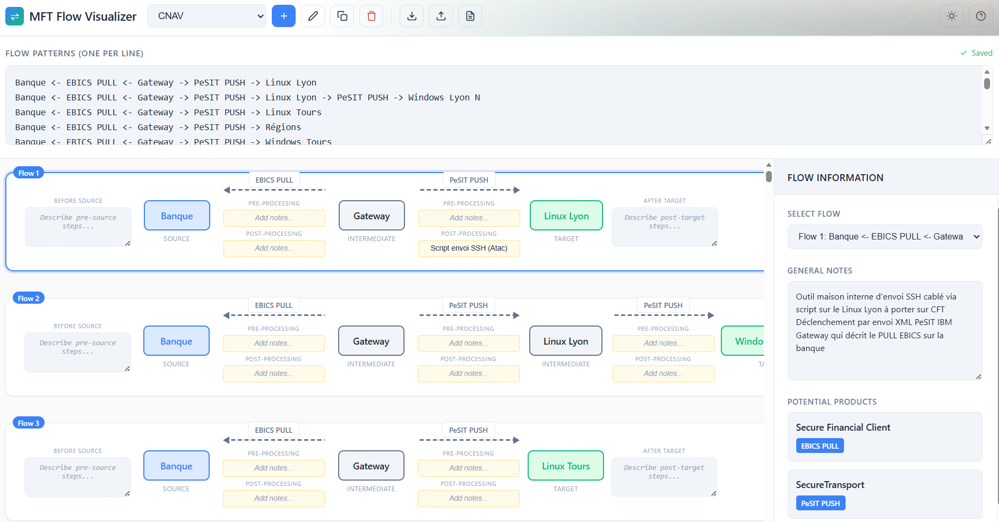

# MFT Flow Visualizer

A powerful web-based tool for designing, visualizing, and documenting Managed File Transfer (MFT) flow patterns. Perfect for architects and engineers planning file transfer migrations to Axway products.



## Features

- **Visual Flow Design** - Create flow diagrams using a simple text-based syntax
- **Multi-Flow Support** - Define multiple flows per workspace (one per line)
- **Product Requirements** - Automatically identifies required Axway products based on protocols used
- **Annotations** - Add pre-processing and post-processing notes to each connection
- **Flow Descriptions** - Document what happens before the source and after the target
- **General Notes** - Add detailed notes for each flow
- **Invalid Protocol Detection** - Highlights unknown protocols and offers correction suggestions
- **Workspaces** - Organize flows into separate workspaces
- **Export/Import** - Share workspaces with colleagues via JSON export
- **PDF Reports** - Generate professional PDF reports with all flow details
- **Dark/Light Theme** - Toggle between themes for comfortable viewing

## Getting Started

Simply open `index.html` in a modern web browser. No installation or server required!

## How to Use

### 1. Define Flow Patterns

Write your flow patterns in the text area using this simple syntax:

```
Source <- PROTOCOL DIRECTION <- Intermediate -> PROTOCOL DIRECTION -> Target
```

**Examples:**
```
Banque <- EBICS PULL <- Gateway -> PeSIT PUSH -> Linux Lyon
Partner <- SFTP PUSH <- SecureTransport -> HTTPS PULL -> Cloud Storage
```

**Direction Keywords:**
- `PULL` - The node pulls/receives data
- `PUSH` - The node pushes/sends data

**Arrow Direction:**
- `<-` indicates flow direction to the left
- `->` indicates flow direction to the right

### 2. View the Visualization

As you type, the flow diagram updates in real-time showing:
- **Source** (blue) - Origin of the data
- **Intermediate** (gray) - Nodes that process/relay the data
- **Target** (green) - Final destination

### 3. Add Details

Select a flow from the dropdown to:
- Add **General Notes** describing the flow purpose
- Add **Before Source** and **After Target** descriptions
- Add **Pre-Processing** and **Post-Processing** annotations on each connection

### 4. Check Product Requirements

The right panel automatically shows which Axway products are required based on the protocols used in your flows:
- SecureTransport
- CFT (Cross File Transfer)
- Secure Financial Client
- API Gateway
- And more...

### 5. Export Your Work

- **Export Workspace** - Save as JSON to share with colleagues
- **Import Workspace** - Load a previously exported workspace
- **Download PDF** - Generate a professional report with all flows and notes

## Supported Protocols

The tool recognizes various MFT protocols including:
- PeSIT, SFTP, FTPS, HTTPS, HTTP
- AS2, AS4, OFTP (Odette)
- EBICS, SWIFTNet
- JMS, MQ, Kafka
- And many more...

## Tips

- Use one flow per line for multiple flows
- Entity names can include spaces and special characters
- Unknown protocols are highlighted with a warning - click to select a valid one
- The PDF report includes all annotations and notes in a clean format

## Technology

Built with vanilla HTML, CSS, and JavaScript. Uses:
- [html2canvas](https://html2canvas.hertzen.com/) for PDF rendering
- [jsPDF](https://github.com/parallax/jsPDF) for PDF generation

## License

Internal Axway tool for MFT migration planning and documentation.
